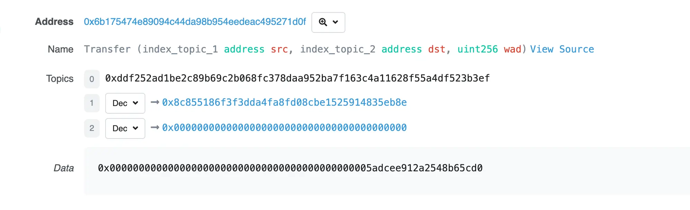
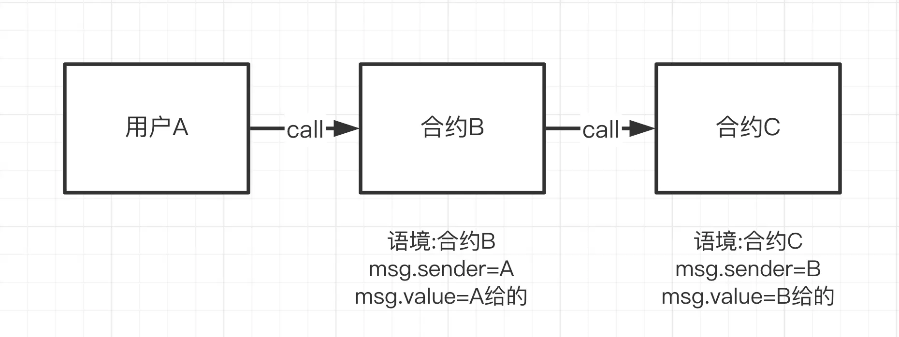
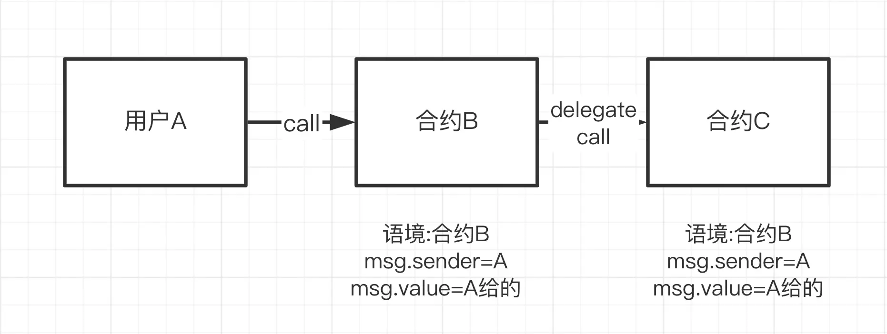
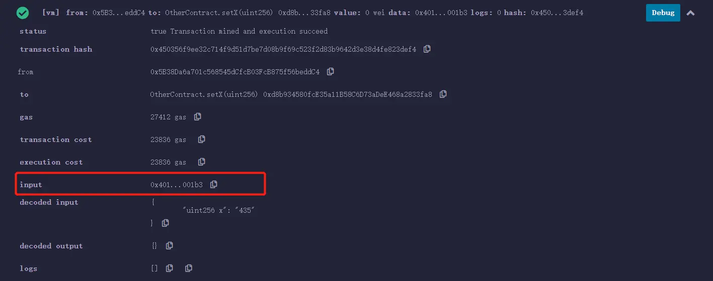

# 参考资料

* [资料](https://www.wtf.academy/zh)
* [代码仓库](https://github.com/AmazingAng/WTF-Solidity)


# 函数

solidity中，函数是可以重载的。不过一个参数可以匹配上多个函数的时候，会报错。比如单实参为8，同时存在形参为`uint8`和`uint256`的函数时，两者都能匹配上

# 变量

## 存储位置

**这块内容主要是针对引用类型**。

引用类型(Reference Type) ：包括数组（array）和结构体（struct），由于这类变量比较复杂，占用存储空间大，我们在使用时必须要声明数据存储的位置。Solidity中变量可以存储在内存中，也可以存储在链上（类似于存储在硬盘中）。变量的修饰符有：

1. calldata修饰的变量存储在内存中，且不可修改，多用在参数上
2. memory修饰的变量也是存储在内存中，但是可以修改，例如：string, bytes, array和自定义结构
3. storage，合约里的状态默认都是storage的，存储在链上，所以消耗的gas最多

这仨的gas消耗：calldata < memory < storage。

由于存储的位置不同，所以在复制变量的时候，要特别注意：

1. 如果是从`memory`复制一个变量到`memory`，那么就是新建了一个引用指向一个内存储位置，所以修改一个变量，另一个也会改变。
2. 其他情况，会在另一个区域创建一个副本，所以修改一个变量，另一个不会改变。比如从storage中拷贝到memory中，如果修改了memory中的变量，storage中的变量不会改变。

## 变量的作用域

变量按作用域划分有三种，分别是状态变量（state variable），局部变量（local variable）和全局变量(global variable)：

1. 状态变量：是存储在链上的变量，合约内所有的函数都可以访问，并且是持久化的，所以gas消耗最多。
2. 局部变量：仅在函数执行过程中有效的变量，函数退出了之后就失效了，存储在内存中，不上链，所以消耗gas小
3. 全局变量：都是Solidity预留的关键字，可以在函数中不声明直接使用，这里是一些常用的全局变量：
   
   > `blockhash(uint blockNumber)`: (bytes32) 给定区块的哈希值 – 只适用于最近的256个区块, 不包含当前区块。
   >
   > `block.coinbase`: (address payable) 当前区块矿工的地址;
   >
   > `block.gaslimit`: (uint) 当前区块的gaslimit
   > 
   > `block.number`: (uint) 当前区块的number
   > 
   > `block.timestamp`: (uint) 当前区块的时间戳，为unix纪元以来的秒
   > 
   > `gasleft()`: (uint256) 剩余 gas
   > 
   > `msg.data`: (bytes calldata) 完整call data
   > 
   > `msg.sender`: (address payable) 消息发送者 (当前 caller)
   > 
   > `msg.sig`: (bytes4) calldata的前四个字节 (function identifier)
   > 
   > `msg.value`: (uint) 当前交易发送的 wei 值
   > 
   > `block.blobbasefee`: (uint) 当前区块的blob基础费用。这是Cancun升级新增的全局变量。
   > 
   > `blobhash(uint index)`: blobhash(uint index): (bytes32) 返回跟当前交易关联的第 index 个blob的版本化哈希（第一个字节为版本号，当前为0x01，后面接KZG承诺的SHA256哈希的最后31个字节）。若当前交易不包含blob，则返回空字节。这是Cancun升级新增的全局变量。

### 全局变量-以太单位

Solidity中不存储小数，而是通过大数的形式来表示，比如1.5 ETH，实际存储的是1500000000000000000Wei，1ETH = 10^18Wei。

* `wei`: 1wei = 1
* `gwei`: 1gwei = 10^9
* `ether`: 1ether = 10^18

### 全局变量-时间单位

可以在合约中规定一个操作必须在一周内完成，或者某个事件在一个月后发生。这样就能让合约的执行可以更加精确，不会因为技术上的误差而影响合约的结果。因此，时间单位在Solidity中是一个重要的概念，有助于提高合约的可读性和可维护性。

* `seconds`: 1
* `minutes`: 60
* `hours`: 3600
* `days`: 86400
* `weeks`: 604800

## 引用类型

主要介绍数组（`array`），还有结构体就不多说了，和GoLang差不多，不过是引用类型，可以参考一下`array`。

### 数组Array

可以分为变长数组和定长数组：

* 定长数组：在声明时就指定长度，比如`uint[8] arr1`
* 变长数组：在生命时不指定长度，比如`uint[] arr2`、`bytes1[] arr3`、`bytes arr4`。`bytes`比较特殊，这是一个变长数组，不能用`bytes[]`来声明，而且`bytes`比`bytes1[]`更加节省gas

#### 数组的创建

如果要创建一个`memory`修饰的数组，可以用`new`关键字，不过创建了之后，数组的长度是固定的，不能再修改。并且创建了之后只能一个个元素赋值，否则就是默认值。

> 如果是`storage`修饰的数组，可以修改数组的长度，比如`push`、`pop`操作。

```solidity
uint[] memory array8 = new uint[](5);
bytes memory array9 = new bytes(9);

uint[] memory x = new uint[](3);
x[0] = 1;
x[1] = 3;
x[2] = 4;
```

也可以通过`[xx, xx, xx]`的方式来创建一个数组，这种方式会以第一个元素的类型来作为数组的类型。如果没有显示声明第一个元素的类型，就会以最小能兼容该元素的类型来作为数组的类型。下面的例子中，如果没有对传入`g()`函数的数组进行 uint 转换，是会报错的。

```solidity
function f() public pure {
    g([uint(1), 2, 3]);
}
function g(uint[3] memory _data) public pure {
    // ...
}
```

#### 数组成员

* `length`: 数组有一个包含元素数量的`length`属性，memory数组的长度在创建后是固定的。
* `push()`: 动态数组拥有`push()`方法，可以在数组最后添加一个0元素，并返回该元素的引用。
* `push(x)`: 动态数组拥有`push(x)`成员，可以在数组最后添加一个x元素。
* `pop()`: 动态数组拥有`pop()`成员，可以移除数组最后一个元素。

### 结构体Struct

```solidity
struct Student {
    uint256 id;
    uint256 score;
}

Student student;
```

## 映射类型（mapping）

使用方式如下：

```solidity
// 声明一个mapping
mapping(address => uint256) public balances;
// 赋值
balances[msg.sender] = 100;
```

1. `mapping`的key只能是solidity自带的类型，不能是结构体。
2. `mapping`的存储位置只能是`storage`，因此可以用于合约的状态变量。
3. 如果`mapping`声明成`public`，solidity会自动创建一个`getter`函数，用于获取`mapping`的值。
4. 因为Ethereum会定义所有未使用的空间为0，所以未赋值`Value`的键`Key`初始值都是各个type的默认值，如uint的默认值是0。

## 变量初始值

可以用`delete`来让变量恢复初始值

```solidity
delete value;
```

# 常数

常数分为常量（`constant`）和不变量（`immutable`）。只有数值变量可以声明为常数。

## constant

`constant`变量必须在声明时初始化，并且不能被修改。

```solidity
uint256 constant MAX_SUPPLY = 1000000;
```

## immutable

`immutable`变量可以在声明时初始化，也可以在构造函数中初始化。并且`immutable`变量不能被修改。

```solidity
// immutable变量可以在constructor里初始化，之后不能改变
uint256 public immutable IMMUTABLE_NUM = 9999999999;
// 在`Solidity v8.0.21`以后,下列变量数值暂为初始值
address public immutable IMMUTABLE_ADDRESS;

constructor() {
    IMMUTABLE_ADDRESS = msg.sender;
}
```

## Gas消耗

访问`constant`变量和`immutable`变量的gas消耗是相同的，都是`0`。但是在部署时，`constant`变量不存储在链上，而是直接作为代码的一部分存在；而`immutable`在合约部署时，需要将`immutable`的值写入内存，在运行时再将值内联替换到字节码中，所以部署是需要消耗一定的gas的，而访问不需要。

# 构造函数（constructor）

每一个合约都可以定义一个构造函数，并且在合约部署时，构造函数会被执行。

```solidity
constructor(address initialOwner) {
    owner = initialOwner; // 在部署合约的时候，将owner设置为传入的initialOwner地址
}
```

# 修饰器（modifier）

类似于面向对象编程中的装饰器，也可以当做一个过滤器来使用。`modifier`的主要使用场景是运行函数前的检查，例如地址，变量，余额等。

```solidity
// 定义一个modifier
modifier onlyOwner {
   require(msg.sender == owner); // 检查调用者是否为owner地址
   _; // 如果是的话，继续运行函数主体；否则报错并revert交易
}

// 使用modifier
function changeOwner(address _newOwner) external onlyOwner{
   owner = _newOwner; // 只有owner地址运行这个函数，并改变owner
}
```

# 事件（event）

事件`event`是EVM上日志的抽象，用于记录一些状态变化，比如`transfer`、`approve`、`mint`、`burn`等。具有两个特点：

1. 响应：应用程序（比如`ether.js`、`go-ethereum`）可以通过RPC接口订阅和监听事件，并在前端做出响应
2. 经济：事件是EVM上比较经济的数据存储的方式，每个事件大约消耗2000gas；而在链上存储一个新的变量至少需要20000gas

## 声明事件

事件的声明如下：

```solidity
// from、to、value：转账地址、接收地址、转账数量
event Transfer(address indexed from, address indexed to, uint256 value);
```

可以看到，from和to两个变量被声明为`indexed`，它们会被保存到以太坊虚拟机日志的`topics`中，方便检索。

## 触发事件

在 Solidity 中，`emit` 关键字用于触发（或释放）一个事件（`event`）。以下是 `emit` 的作用和使用场景的详细说明：

```solidity
emit Transfer(from, to, value);
```

## EVM日志

EVM用日志`Log`来存储solidity事件，每条日志包括主题`topic`和数据`data`。



### 主题topic

日志的第一部分是主题数组，用于描述事件，长度不能超过4。它的第一个元素是事件的签名（哈希）。对于上面的Transfer事件，它的事件哈希就是：

```solidity
keccak256("Transfer(address,address,uint256)"); //0xddf252ad1be2c89b69c2b068fc378daa952ba7f163c4a11628f55a4df523b3ef
```

除了事件hash，最多还能有3个indexed参数，对于上面定义的事件`Transfer`，也就是from和to。每个`index`参数的大小都固定是256bit，如果参数太大了，就会自动计算hash存储在`topic`中。对于非值类型的参数，比如arrays、bytes、string，solidity不会直接存储，而是将Keccake-256的hash存储在`topic`中，这可能会导致数据信息丢失。对于某些依赖于链上事件的Dapp，可能会导致事件检索困难，需要解析hash。

### 数据data

事件中不带`index`的参数会存储在`data`中，比如上面定义的事件`Transfer`，`value`会存储在`data`中。`data`中的数据没法被直接检索，但是没有大小的限制，因此一般用`data`部分来存储复杂的数据结构。另外，`data`部分的变量存储在链上的gas消耗相比于`topic`更少。

# 继承

* `virtual`：父合约中的函数，如果希望子合约重写这个函数或者修饰器，那么这个函数必须声明为`virtual`
* `override`：子合约重写父合约中的函数或者修饰器时，必须声明为`override`

如果是用`override`修饰了变量，会重写与变量同名的`getter`方法

```solidity
mapping(address => uint256) public override balanceOf;
```

## 简单继承

solidity通过`is`关键字来实现继承

## 多重继承

1. solidity支持多重继承，但是多重继承的顺序不能改变，必须从左到右，按照辈分从高到低，否则会报错。
2. 当继承的多个合约都声明了同一个方法时，override中必须显示声明这些父合约

## 构造函数的继承

1. 在继承时声明父构造函数的参数，例如：`contract B is A(1)`，不过这种方式只能写死参数
2. 在子合约的构造函数中声明构造函数的参数，例如：`constructor(uint256 _a) A(_a) {}`，这种方式可以动态的传入参数

## 调用父合约的函数

1. 子合约可以直接用`父合约名.函数名()`
2. 用`super.函数名()`来调用最近的父合约函数

## 菱形继承（钻石继承）

钻石继承（菱形继承）指一个派生类同时有两个或两个以上的基类。比如：

```js
/* 继承树：
  God
 /  \
Adam Eve
 \  /
people
*/
```

当God中有一个方法`foo`，Adam和Eva重载了`foo`，并且都调用了`super.foo()`。people的继承顺序是Adam、Eva，也重载了`foo`，并且调用了`super.foo()`，那么调用顺序是**Adam.foo() -> Eva.foo() -> God.foo()**。原因是Solidity借鉴了Python的方式，强制一个由基类构成的DAG（有向无环图）使其保证一个特定的顺序。

# 抽象合约和接口

## 抽象合约

如果一个合约中存在抽象方法，即没有实现方法体的方法，那么必须把这个合约声明成`abstract`。

```solidity
abstract contract InsertionSort{
    function insertionSort(uint[] memory a) public pure virtual returns(uint[] memory);
}
```

## 接口

接口类似于抽象合约，但它不实现任何功能。

1. 不能包含状态变量
2. 不能包含构造函数
3. 不能继承除接口外的其他合约
4. 所有函数都必须是`external`且不能有函数体
5. 继承接口的非抽象合约必须实现接口定义的所有功能

接口提供了两个重要的信息：

1. 合约里每个函数的bytes4选择器，以及函数签名函数名（每个参数类型）。**注意，在函数签名中，uint和int要写为uint256和int256。**
2. 接口id（更多信息见EIP165）

另外，接口与合约ABI（Application Binary Interface）等价，可以相互转换：编译接口可以得到合约的ABI，利用abi-to-sol工具，也可以将`ABI json`文件转换为接口`sol`文件。

```solidity
interface IERC20 {
    function totalSupply() external view returns (uint256);
}
```

### IERC27

```solidity
interface IERC721 is IERC165 {
    event Transfer(address indexed from, address indexed to, uint256 indexed tokenId);
    event Approval(address indexed owner, address indexed approved, uint256 indexed tokenId);
    event ApprovalForAll(address indexed owner, address indexed operator, bool approved);
    
    function balanceOf(address owner) external view returns (uint256 balance);

    function ownerOf(uint256 tokenId) external view returns (address owner);

    function safeTransferFrom(address from, address to, uint256 tokenId) external;

    function transferFrom(address from, address to, uint256 tokenId) external;

    function approve(address to, uint256 tokenId) external;

    function getApproved(uint256 tokenId) external view returns (address operator);

    function setApprovalForAll(address operator, bool _approved) external;

    function isApprovedForAll(address owner, address operator) external view returns (bool);

    function safeTransferFrom( address from, address to, uint256 tokenId, bytes calldata data) external;
}
```

### IERC721事件

IERC721包含3个事件，其中Transfer和Approval事件在ERC20中也有。

1. `Transfer`：在转账时被释放，记录代币的发出地址from，接收地址to和tokenId。
2. `Approval`：在授权时被释放，记录授权地址owner，被授权地址approved和tokenId。
3. `ApprovalForAll`：在批量授权时被释放，记录批量授权的发出地址owner，被授权地址operator和授权与否的approved。

### IERC721函数

1. `balanceOf`：返回某地址的NFT持有量balance。
2. `ownerOf`：返回某tokenId的主人owner。
3. `transferFrom`：普通转账，参数为转出地址from，接收地址to和tokenId。
4. `safeTransferFrom`：安全转账（如果接收方是合约地址，会要求实现ERC721Receiver接口）。参数为转出地址from，接收地址to和tokenId。
5. `approve`：授权另一个地址使用你的NFT。参数为被授权地址approve和tokenId。
6. `getApproved`：查询tokenId被批准给了哪个地址。
7. `setApprovalForAll`：将自己持有的该系列NFT批量授权给某个地址operator。
8. `isApprovedForAll`：查询某地址的NFT是否批量授权给了另一个operator地址。
9. `safeTransferFrom`：安全转账的重载函数，参数里面包含了data。

# 异常

solidity有三种异常抛出方法：`revert`、`require`、`assert`。

## revert

`error`是solidity0.8.4新加的内容。

```solidity
// 自定义error
error TransferNotOwner(address sender);
```

在使用是，必须搭配`revert`（回退）命令使用。

```solidity
function transferOwner(uint256 tokenId, address newOwner) public {
    if(_owners[tokenId] != msg.sender){
        // revert TransferNotOwner();
        revert TransferNotOwner(msg.sender);
    }
    _owners[tokenId] = newOwner;
}
```

## require

`require`是solidity0.8版本之前的异常抛出方法，现在仍然有很多主流的合约在使用。唯一的缺点就是gas消耗较高。使用方法：`require(检查条件，"异常的描述")`，当检查条件不成立的时候，就会抛出异常。

## assert

`assert`一般用于程序员debug，它不能解释抛出的异常。用法很简单：`assert(检查条件)`，当检查条件不成立的时候，就会抛出异常。

# 使用其他合约

## 库合约

常用的库合约有：
1. `Strings`：将`uint256`转换成`string`
2. `Address`：判断某个地址是否是合约地址
3. `Create2`：更安全的使用EVM
4. `Arrays`：数组相关的库合约

### 使用

以`Strings`为例，使用方法如下：

1. 通过`using A for B`，可用于附加库合约（从库 A）到任何类型（B）。添加完指令后，库A中的函数会自动添加为B类型变量的成员，可以直接调用。注意：在调用的时候，这个变量会被当作第一个参数传递给函数：
   ```solidity
   using Strings for uint256;
   
   function getString1(uint256 _number) public pure returns(string memory) {
       // 库合约中的函数会自动添加为uint256型变量的成员
       return _number.toHexString();
   }
   ```
2. 直接通过库合约名
   ```solidity
   return Strings.toHexString(_number);
   ```

## import

可以通过`import`引入其他sol文件的内容。

1. 通过源文件相对位置导入
   ```solidity
   import "./Strings.sol";
   ```
2. 通过源文件网址导入网上的合约的全局符号
   ```solidity
   // 导入其他网址，多用于自己开发或者公司项目
   import 'https://github.com/OpenZeppelin/openzeppelin-contracts/blob/master/contracts/utils/Address.sol';
   ```
3. 通过npm的目录导入
   ```solidity
   // 导入其他公司的，比如openzeppelin
   import '@openzeppelin/contracts/access/Ownable.sol';
   ```
4. 通过指定全局符号导入合约特定的全局符号
   ```solidity
   import {Yeye} from './Yeye.sol';
   ```

# 接收发送ETH

## 接收ETH

Solidity支持两种特殊的回调函数，`receive()`和`fallback()`用于接收ETH和处理合约中不存在的函数调用（代理合约proxy contract）

### 接收ETH函数 receive

`receive()`函数在合约收到ETH的时候被调用，每个合约只能有一个`receive()`函数，并且必须没有参数和返回值。必须包含`external`和`payable`修饰符。

```solidity
// 定义事件
event Received(address Sender, uint Value);
// 接收ETH时释放Received事件
receive() external payable {
    emit Received(msg.sender, msg.value);
}
```

`receive()`最好不要有太多的逻辑，因为如果别人触发这个函数，gas一般会限制在2300以内，如果逻辑过长，可能会超出gas限制，导致交易失败。如果用`call`就可以自定义gas执行更复杂的逻辑。

### 回退函数 fallback

`fallback()`函数会在调用合约不存在的函数的时候被调用。可以用于接收ETH，也可以用于代理合约proxy contract。`fallback()`声明时不需要`function`关键字，必须由`external`修饰，一般也会用`payable`修饰，用于接收ETH。

```solidity
event fallbackCalled(address Sender, uint Value, bytes Data);

// fallback
fallback() external payable{
    emit fallbackCalled(msg.sender, msg.value, msg.data);
}
```

### receive和fallback的区别

```
触发fallback() 还是 receive()?
           接收ETH
              |
         msg.data是空？
            /  \
          是    否
          /      \
receive()存在?   fallback()
        / \
       是  否
      /     \
receive()   fallback()
```

`receive()`和`fallback() payable`均不存在时，向合约**直接**发送ETH会报错（你仍可以通过带有`payable`的函数向合约发送ETH）。

## 发送ETH

Solidity有三种方法向其他合约发送ETH，他们是：`transfer()`，`send()`和`call()`，其中`call()`是被鼓励的用法。

假设我们通过一个合约，给另一个合约/地址转账，那么这个合约必须要有一定的ETH。可以通过给构造函数增加`payable`的方式，在部署的时候，给合约本身增加ETH：`constructor() payable {}`。

### transfer

* `transfer()`的gas限制是2300，足够用于转账，但是对方的`fallback()`或者`receive()`函数如果太复杂，可能会超出gas限制，导致交易失败。
* 如果`transfer()`失败，会自动`revert()`（回滚交易）
* 用法：`接收方地址.transfer(金额)`

```solidity
// 用transfer()发送ETH
function transferETH(address payable _to, uint256 amount) external payable {
    _to.transfer(amount);
}
```

### send

* `send()`的gas限制是2300，足够用于转账，但是对方的`fallback()`或者`receive()`函数如果太复杂，可能会超出gas限制，导致交易失败。
* 如果`send()`失败，会返回`false`，不会自动`revert()`，需要额外的代码处理失败的情况
* 用法：`接收方地址.send(金额)`

```solidity
// 使用send发送失败的error
error SendFailed();

// send()发送ETH
function sendETH(address payable _to, uint256 amount) payable external {
    bool success = _to.send(amount);
    if (!success) {
        revert SendFailed();
    }
}
```

### call

* `call()`是推荐的用法，没有gas限制，所以可以支持对方合约的`fallback()`和`receive()`实现复杂的逻辑
* `call()`如果转账失败，返回值是`(bool, bytes)`，也是通过额外的代码处理失败的情况
* 用法：`接收方地址.call{value:金额}("")`

```solidity
// 使用call发送失败的error
error CallFailed();

// call()发送ETH
function callETH(address payable _to, uint256 amount) payable external {
    // 处理下call的返回值，如果失败，revert交易并发送error
    (bool success, ) = _to.call{value: amount}("");
    if (!success) {
        revert CallFailed();
    }
}
```

# 调用其他合约

可以利用合约的地址和合约代码（接口）来创建合约引用：`ContractName cn = contractName(address)`，然后用该引用来调用目标合约的函数：`cn.functionName(args)`/`contractName(address).functionName(args)`。

也可以将合约引用作为参数传递给其他函数：`functionName(ContractName cn, args)`。这个参数`cn`本质就是一个address。

```solidity
function callGetX(OtherContract _Address) external view returns(uint x){
    x = _Address.getX();
}
```

可以调用一个`payable`修饰的函数，给这个合约转账：

```solidity
function setXTransferETH(address _address, uint256 x) payable external {
    OtherContract(_address).setX{value: msg.value}(x);
}
```

## 通过call调用其他合约

上面降到过`call`方法，`call`是`address`类型的低级成员函数，用来和其他合约交互。它的返回值为`(bool, bytes memory)`，分别对应`call`是否成功以及目标函数的返回值。

* `call`是solidity官方推荐的通过触发`fallback`和`receive`发送ETH的方式，不推荐用`call`来调用其他函数，因为当你调用不安全合约的函数时，你就把主动权交给了它。推荐的方法仍是声明合约变量后调用函数。
* 当不知道对方合约的源码或`ABI`时，就没法生成合约变量，`call`是唯一能调用对方合约的函数。

使用方式：`对方合约地址.call(字节码)`。其中，`字节码`利用结构化编码函数`abi.encodeWithSignature()`来生成：`abi.encodeWithSignature("函数名(参数类型)", 参数)`。`函数签名`为：`函数名(参数)`，比如：`abi.encodeWithSignature("f(uint256,address)", _x, _addr)`。另外，`call`在调用合约的时候可以指定交易发送的ETH和gas：`目标合约地址.call{value:发送数额, gas:gas数额}(字节码)`。

`call`了不存在的，`call`仍能执行成功，并返回`success`，但其实调用的目标合约`fallback`函数。

## delegatecall

`delegatecall`和`call`一样，都是`address`类型的低级成员函数。假设有一个用户A，两个合约`ContractB`和`ContractC`，`ContractA`调用`ContractB`的函数，`ContractB`调用`ContractC`的函数：

1. 如果是用`call`来调用，那么`ContractC`的`contract`（上下文）是`ContractC`的
   
2. 如果使用`delegatecall`，那么`ContractC`的`contract`是`ContractB`的。
   

可以这样理解：一个投资者（用户A）把他的资产（B合约的状态变量）都交给一个风险投资代理（C合约）来打理。执行的是风险投资代理的函数，但是改变的是资产的状态。

`delegatecall`的用法和`call`类似，也是`目标合约地址.delegatecall(二进制编码)`，二进制编码也是通过`abi.encodeWithSignature()`来生成的：`abi.encodeWithSignature(函数名(参数类型)", 参数))`。

和`call`不一样，`delegatecall`在调用合约的时候可以指定gas，不能指定eth。

> 注意：`delegatecall`有安全隐患，使用时要保证当前合约和目标合约的状态变量存储结构相同，并且目标合约安全，不然会造成资产损失。

### 什么时候需要用delegatecall？

目前`delegatecall`主要有两个用途：

1. 代理合约（`Proxy Contract`）：将智能合约的存储合约和逻辑合约分开。`Proxy Contract`存储所有相关的变量，并且保存逻辑合约的地址；所有函数存储在逻辑合约（`Logic Contract`）中，通过`delegatecall`调用。当升级时，只需要将代理合约的地址指向新的逻辑合约地址。
2. EIP-2535 Diamonds（钻石）：钻石是一个支持构建可在生产中扩展的模块化智能合约系统的标准。钻石是具有多个实施合约的代理合约。

# 创建合约

在链上，用户可以创建合约，合约也可以创建合约。去中心化交易所`uniswap`就是利用合约工厂`PairFactory`创建了无数个币对合约`Pair`。

## create

`create`用法如下：如果构造函数是`payable`修饰的，还可以指定构造合约的`value`

```solidity
Contract x = new Contract{value: _value}(params)
```

## create2

`CREATE2`操作码使我们在智能合约部署在以太坊网络之前就能预测合约的地址。Uniswap创建Pair合约用的就是`CREATE2`而不是`CREATE`。

智能合约可以由其他合约和普通账户利用`CREATE`操作码创建。 在这两种情况下，新合约的地址都以相同的方式计算：创建者的地址(通常为部署的钱包地址或者合约地址)和`nonce`(该地址发送交易的总数,对于合约账户是创建的合约总数,每创建一个合约`nonce+1`)的哈希。**新地址 = hash(创建者地址, nonce)**。创建者地址不会变，但`nonce`可能会随时间而改变，因此用`CREATE`创建的合约地址不好预测。

### create2是如何计算合约地址的

`CREATE2`的目的是为了让合约地址独立于未来的事件。不管未来区块链上发生了什么，你都可以把合约部署在事先计算好的地址上。用`CREATE2`创建的合约地址由4个部分决定：

1. `0xFF`：一个常数，避免和`CREATE`冲突
2. `CreatorAddress`: 调用`CREATE2`的当前合约（创建合约）地址。
3. `salt`（盐）：一个创建者指定的`bytes32`类型的值，它的主要目的是用来影响新创建的合约的地址。
4. `initcode`: 新合约的初始字节码（合约的Creation Code和构造函数的参数）。

**新地址 = hash("0xFF",创建者地址, salt, initcode)**。`CREATE2`确保，如果创建者使用`CREATE2`和提供的`salt`部署给定的合约`initcode`，它将存储在**新地址**中。

用法：`Contract x = new Contract{salt: _salt, value: _value}(params)`。

### create2的实际应用场景

1. 交易所为新用户预留创建钱包合约地址。
2. 由`CREATE2`驱动的`factory`合约，在Uniswap V2中交易对的创建是在`Factory`中调用`CREATE2`完成。这样做的好处是: 它可以得到一个确定的pair地址, 使得 Router中就可以通过`(tokenA, tokenB)`计算出pair地址, 不再需要执行一次`Factory.getPair(tokenA, tokenB)`的跨合约调用。

# 删除合约

`selfdestruct`命令可以用来删除合约，并将合约的余额转移到指定地址。用法：`selfdestruct(address)`，其中`address`为要转移的余额的地址。`address`地址不需要有`receive()`或`fallback()`也能接收ETH。

当我们触发`selfdestruct`操作时，在坎昆升级前，合约会被自毁。但是在升级后，合约依然存在，只是将合约包含的ETH转移到指定地址，而合约依然能够调用。根据提案，原先的删除功能只有在合约创建-自毁这两个操作处在同一笔交易时才能生效。

# ABI编码解码

[具体内容在这里，参考下这个](https://www.wtf.academy/zh/course/solidity102/ABIEncode)

ABI (Application Binary Interface，应用二进制接口)是与以太坊智能合约交互的标准。数据基于他们的类型编码；并且由于编码后不包含类型信息，解码时需要注明它们的类型。

Solidity中，ABI编码有4个函数：`abi.encode`、`abi.encodePacked`、`abi.encodeWithSignature`、`abi.encodeWithSelector`。而ABI解码有1个函数：`abi.decode`，用于解码`abi.encode`的数据。

## abi.encode

ABI被设计出来跟智能合约交互，他将每个参数填充为32字节的数据，并拼接在一起。如果你要和合约交互，你要用的就是`abi.encode`。

## abi.encodePacked

将给定参数根据其所需最低空间编码。它类似`abi.encode`，但是会把其中填充的很多0省略。比如，只用1字节来编码uint8类型。当你想省空间，并且不与合约交互的时候，可以使用`abi.encodePacked`，例如算一些数据的hash时。需要注意，`abi.encodePacked`因为不会做填充，所以不同的输入在拼接后可能会产生相同的编码结果，导致冲突，这也带来了潜在的安全风险。

## abi.encodeWithSignature

与`abi.encode`功能类似，只不过第一个参数为函数签名，比如`"foo(uint256,address,string,uint256[2])"`。当调用其他合约的时候可以使用。

## abi.encodeWithSelector

与`abi.encodeWithSignature`功能类似，只不过第一个参数为函数选择器，为`函数签名`Keccak哈希的前4个字节。

## abi.decode

`abi.decode`用于解码`abi.encode`生成的二进制编码，将它还原成原本的参数。

# Keccak256

用法很简单：`哈希 = keccak256(数据)`

```solidity
function hash(
    uint _num,
    string memory _string,
    address _addr
    ) public pure returns (bytes32) {
    return keccak256(abi.encodePacked(_num, _string, _addr));
}
```

# 选择器

选择器是函数签名的哈希的前4个字节，用于调用函数。当我们调用智能合约时，本质上是向目标合约发送了一段`calldata`，在remix中发送一次交易后，可以在详细信息中看见input即为此次交易的`calldata`，发送的`calldata`中前4个字节是`selector`（函数选择器）。



可以将`input`分成两个部分，前4个字节字节是`selector`，指向调用的函数的地址，后面的部分就是传递的参数。

由于计算`method id`时，需要通过函数名和函数的参数类型来计算。在Solidity中，函数的参数类型主要分为：基础类型参数，固定长度类型参数，可变长度类型参数和映射类型参数。

## 基础类型参数

`bytes4(keccak256("elementaryParamSelector(uint256,bool)"))`

## 固定长度类型参数

`bytes4(keccak256("fixedSizeParamSelector(uint256[3])"))`

## 可变长度类型参数

`bytes4(keccak256("nonFixedSizeParamSelector(uint256[],string)"))`

## 映射类型参数

映射类型参数通常有：contract、enum、struct等。在计算method id时，需要将该类型转化成为ABI类型。

假设有一个结构体User

```solidity
struct User {
    uint256 id;
    string name;
}
```

那么需要将参数转为tuple类型，即`(uint256,string)`：`bytes4(keccak256("mappingParamSelector(address,(uint256,bytes),uint256[],uint8)"))`

## 使用selector

可以利用`selector`来调用目标函数。只需要知道函数的`method id`即可：`(bool success1, bytes memory data1) = address(this).call(abi.encodeWithSelector(0x3ec37834, 1, 0))`

# try-catch

用法：

```solidity
try externalContract.f() {
    // call成功的情况下 运行一些代码
} catch {
    // call失败的情况下 运行一些代码
}
```

如果调用的函数有返回值：

```solidity
try externalContract.f() returns(returnType val){
    // call成功的情况下 运行一些代码
} catch {
    // call失败的情况下 运行一些代码
}
```

另外，`catch`模块支持捕获特殊的异常原因：

```solidity
try externalContract.f() returns(returnType){
    // call成功的情况下 运行一些代码
} catch Error(string memory /*reason*/) {
    // 捕获revert("reasonString") 和 require(false, "reasonString")
} catch Panic(uint /*errorCode*/) {
    // 捕获Panic导致的错误 例如assert失败 溢出 除零 数组访问越界
} catch (bytes memory /*lowLevelData*/) {
    // 如果发生了revert且上面2个异常类型匹配都失败了 会进入该分支
    // 例如revert() require(false) revert自定义类型的error
}
```